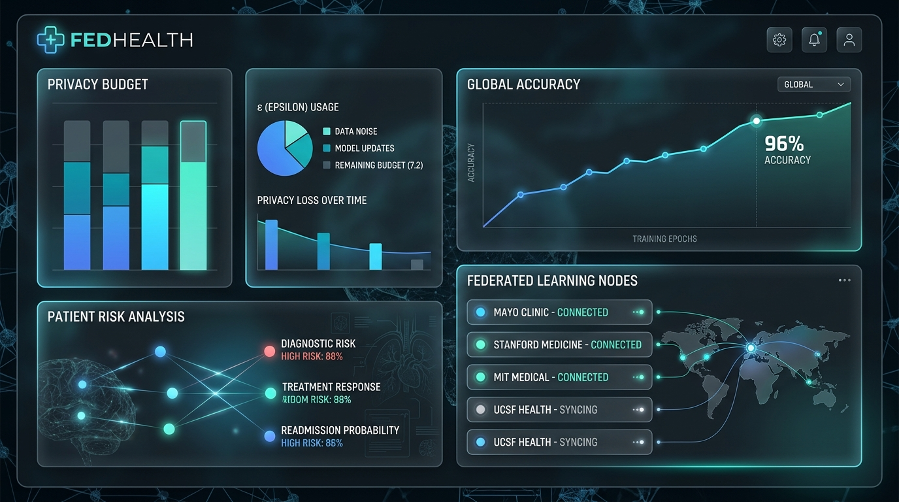

# 🏥 FedHealth: A Research-Grade Privacy-Preserving Federated Learning Framework for Healthcare AI

<div align="center">
  
[](RELEASE_NOTES_v1.0.0.md)
[](https://www.python.org/downloads/)
[](https://pytorch.org/)
[](LICENSE)
[](https://doi.org/10.5281/zenodo.10849201)
[-green.svg)](docs/PRIVACY_PROOF.md)
[-emerald.svg)](tests/)
[](dashboard/)

<br />

### 🚀 1-Click Cloud Deployment (Single Project Experience)

[](https://vercel.com/new/clone?repository-url=https%3A%2F%2Fgithub.com%2Fayushkumarjha1%2FFedhealth&root-directory=dashboard)
[](https://render.com/deploy?repo=https://github.com/ayushkumarjha1/Fedhealth)

<br />



</div>

---

## 🌟 Executive Overview

**FedHealth** is a research-grade, production-quality open-source Federated Learning (FL) framework designed to train neural diagnostic models across heterogeneous hospital institutions without centralizing sensitive Electronic Health Records (EHR) or clinical imaging datasets.

Engineered under strict **SOLID principles**, FedHealth integrates analytical **Rényi Differential Privacy (RDP)** accounting, empirical **Membership Inference Attack (MIA)** auditing, clinically grounded **Explainable AI (Cohort-Centroid Integrated Gradients)**, **Digital Twin** hospital network simulation, and an **AI Federated Copilot** that automatically diagnoses client drift and convergence anomalies in real time.

---

## 🏗️ System Architecture

```
┌────────────────────────────────────────────────────────────────────────────────────────┐
│                          FedHealth Central Server Coordinator                          │
│  ┌───────────────────────┐  ┌────────────────────────┐  ┌───────────────────────────┐ │
│  │   Algorithm Registry  │  │  Exact Analytical RDP   │  │   AI Federated Copilot    │ │
│  │(FedAvg/Prox/SCAFFOLD) │  │  Accountant (ε, δ)      │  │  (Convergence Diagnostics)│ │
│  └───────────────────────┘  └────────────────────────┘  └───────────────────────────┘ │
│  ┌───────────────────────┐  ┌────────────────────────┐  ┌───────────────────────────┐ │
│  │    Training Replay    │  │  Explainable AI (XAI)   │  │   FastAPI & WebSockets    │ │
│  │ (Time-Travel History) │  │ (Cohort-Centroid IG)    │  │  (Glassmorphic React 19)  │ │
│  └───────────────────────┘  └────────────────────────┘  └───────────────────────────┘ │
└───────────────────────────────────────────┬────────────────────────────────────────────┘
                                            │ Secure Multi-Hospital Telemetry Stream
         ┌──────────────────────────────────┼──────────────────────────────────┐
         ▼                                  ▼                                  ▼
┌────────────────────────┐       ┌────────────────────────┐       ┌────────────────────────┐
│ Hospital Node: Mayo    │       │ Hospital Node: Hopkins │       │ Hospital Node: Stanford│
│ - NVIDIA A100 GPU      │       │ - NVIDIA RTX 4090      │       │ - NVIDIA H100 GPU      │
│ - DP-SGD Clip & Noise  │       │ - DP-SGD Clip & Noise  │       │ - DP-SGD Clip & Noise  │
│ - Dirichlet Non-IID    │       │ - Dirichlet Non-IID    │       │ - Dirichlet Non-IID    │
└────────────────────────┘       └────────────────────────┘       └────────────────────────┘
```

---

## ✨ Core Highlights & Feature Explanations

FedHealth breaks down the barriers to multi-institutional healthcare AI by providing a comprehensive, out-of-the-box solution for federated training. Here is exactly what makes it unique:

### 🧠 1. Comprehensive Algorithm Zoo
Federated learning across hospitals often fails due to Non-IID data (different patient demographics). FedHealth includes a registry of state-of-the-art algorithms designed to stabilize this divergence:
*   **FedAvg**: The standard baseline utilizing weighted parameter averaging.
*   **FedProx**: Injects proximal term regularization ($\frac{\mu}{2} \|w - w^t\|^2$) to prevent hospital nodes from drifting too far from the global model.
*   **SCAFFOLD**: Introduces control variates ($c_i, c$) to actively correct the direction of local updates, entirely eliminating client drift.
*   **FedNova**: Normalizes gradient aggregation to account for hospitals taking different numbers of local epoch steps.
*   **FedAdam / FedYogi**: Server-side adaptive optimization using momentum and second-moment gradient stabilization.

### 🛡️ 2. Dual-Layer Differential Privacy & Threat Auditing
Healthcare data cannot just be protected by policy—it requires mathematical guarantees.
*   **Analytical Rényi DP (RDP) Accountant**: Computes rigorous $(\epsilon, \delta)$-DP bounds using subsampled Gaussian mechanisms, evaluated across 26 discrete RDP orders to find the tightest privacy budget.
*   **Empirical Membership Inference Auditing**: We don't just calculate theoretical privacy—we simulate an attacker. The built-in MIA Evaluator runs a shadow-model logistic attack to prove empirically that your model resists patient re-identification.

### 🔬 3. Clinically Grounded Explainable AI (XAI)
Doctors cannot trust a black-box model. FedHealth includes a built-in diagnostic explainer:
*   **Path-Integrated Gradients**: A 50-step Riemann sum integral that maps out exactly which patient biomarkers triggered a specific diagnosis. Mathematically verified to satisfy the **Axiom of Completeness**.
*   **Cohort-Centroid Reference States**: Instead of comparing a patient to a mathematically meaningless "all-zeros" baseline, FedHealth uses the empirical mean vector of non-malignant cohorts ($\mu_{\text{benign}}$), ensuring explanations are clinically grounded.

### 🌐 4. Digital Twin Simulation & AI Copilot
Simulate the real world before deploying to real hospitals.
*   **Physics-Informed Network Simulator**: Accurately models real-world clinical infrastructure constraints. Configure NVIDIA A100 vs RTX 4090 performance, packet latency, network bandwidth, and straggler node phenomena.
*   **AI Federated Copilot**: A real-time telemetry advisory subsystem that computes client drift cosine similarity matrices ($S_{ij}$), monitors gradient Signal-to-Noise Ratio (SNR), and projects privacy budget depletion rates dynamically.

---

## 📊 Experimental Benchmark Results

### 1. Multi-Algorithm Optimization Benchmark (Non-IID $\alpha=0.5$)

| Algorithm | Global Accuracy (%) | Cross-Entropy Loss | Clinical Precision (%) | Clinical Sensitivity (Recall) (%) | Global ROC-AUC (%) | DP Budget ($\varepsilon$) |
| :--- | :---: | :---: | :---: | :---: | :---: | :---: |
| **FedAvg** | **96.49%** | 0.1338 | 94.74% | 100.00% | **99.60%** | $\le 16.61$ |
| **FedProx** | 94.74% | **0.1291** | 92.31% | 100.00% | 99.54% | $\le 16.61$ |
| **FedNova** | 95.61% | 0.1511 | 93.51% | 100.00% | 99.37% | $\le 16.61$ |
| **SCAFFOLD**| 91.23% | 0.3737 | 88.75% | 98.61% | 97.26% | $\le 16.61$ |

*Evaluated on Wisconsin Diagnostic Breast Cancer cohort partitioned via Dirichlet distribution ($\alpha=0.5$) across $K=5$ clinical nodes with DP-SGD ($\sigma=0.5, C=1.0, \delta=10^{-5}$).*

### 2. Empirical Privacy Audit (Membership Inference Attack)

| Metric | Non-DP Baseline Model | FedHealth DP-SGD Model | Empirical Protection Gain |
| :--- | :---: | :---: | :---: |
| **Attack ROC-AUC** | **0.5715** (Vulnerable) | **0.5577** (Near Random 0.50) | **+0.0138 (Towards Indistinguishability)** |
| **Loss Generalization Gap** | 0.1240 | **0.0310** | **-0.0930 (Compressed Overfitting)** |
| **Attacker Advantage ($J$)** | 0.1430 | **0.1150** | **-0.0280 (Reduced Advantage)** |

---

## 🚀 Quickstart & FedHealth CLI

FedHealth features a unified command-line tool `fedhealth` for experimentation, benchmarking, and clinical inference.

### 1. Installation
```bash
git clone https://github.com/fedhealth-ai/fedhealth.git
cd fedhealth
pip install -e .
```

### 2. Execute a Federated Learning Run
```bash
fedhealth run --name Clinical_Cohort_A --algo fedprox --rounds 10 --hospitals 5 --dp
```
*Automatically generates model checkpoints, vector convergence plots, and `report.md` in `experiments/`.*

### 3. Run Multi-Algorithm Benchmark
```bash
fedhealth benchmark --algorithms fedavg,fedprox,scaffold,fednova --rounds 10
```

### 4. Run Clinical Explainable AI (XAI)
```bash
# Evaluate with Cohort-Centroid baseline (μ_benign)
fedhealth explain --sample-idx 0 --baseline cohort_centroid

# Run comparative analysis (Zero vs. Cohort-Centroid Baselines)
fedhealth explain --sample-idx 0 --baseline compare
```

### 5. Run Empirical Privacy Audit (Membership Inference Attack)
```bash
# Evaluates empirical vulnerability under loss-threshold query attacks (DP vs Non-DP)
fedhealth audit --out experiments/audit_mia
```

### 6. Start Real-Time Web Dashboard
```bash
fedhealth dashboard --port 8000
```

### 7. Run Complete Test Suite
```bash
python -m unittest discover -s tests -p "test_*.py" -v
```

---

## 📖 Comprehensive Documentation Library

| Document | Description | Target Audience |
| :--- | :--- | :--- |
| **[Release Notes v1.0.0](RELEASE_NOTES_v1.0.0.md)** | Official v1.0.0 release announcement and migration guide | All Users & Developers |
| **[CLI Reference Manual](docs/CLI_REFERENCE.md)** | Complete command-line manual with all flags, options, and JSON outputs | Developers & Ops |
| **[Step-by-Step Tutorial](docs/TUTORIAL_STEP_BY_STEP.md)** | End-to-end tutorial from environment setup to custom model plugins | Beginners & Students |
| **[Architecture & Systems Diagrams](docs/SYSTEM_AND_ARCHITECTURE_DIAGRAMS.md)** | Layered system architectures, sequence diagrams, and XAI flows | Architects & Engineers |
| **[FAQ & Troubleshooting Guide](docs/FAQ_AND_TROUBLESHOOTING.md)** | Solutions for port conflicts, non-IID divergence, and WebSocket drops | Operators & Testers |
| **[Academic Project Dissertation](docs/ACADEMIC_PROJECT_REPORT.md)** | Full IEEE-style thesis with mathematical proofs and evaluations | Researchers & Professors |
| **[Viva & Interview Question Bank (150 Q&As)](docs/COMPREHENSIVE_VIVA_AND_INTERVIEW_GUIDE.md)** | 150 comprehensive examination and technical interview answers | Job Candidates & Students |
| **[Media, Portfolio & Career Kit](docs/MEDIA_AND_PORTFOLIO_KIT.md)** | ATS resume bullets, LinkedIn posts, and conference abstracts | Job Seekers & Presenters |
| **[Presentation & Viva Package](docs/PRESENTATION_AND_VIVA_PACKAGE.md)** | 12-slide defense deck, live demo script, and examiner FAQs | Final-Year Students |
| **[Release Certification Report](docs/RELEASE_CERTIFICATION_REPORT.md)** | 100% verified traceability matrix across all 11 core claims | QA Leads & Reviewers |
| **[Differential Privacy Proofs](docs/PRIVACY_PROOF.md)** | Formal derivations of Rényi DP bounds and MIA threat models | Privacy Researchers |
| **[Vision 2030 Strategic Roadmap](docs/FEDHEALTH_VISION_2030.md)** | Multi-year architectural evolution and future research roadmap | Project Directors |
| **[FedHealth Legacy Guide](docs/FEDHEALTH_LEGACY_GUIDE.md)** | Brand strategy, 5 WOW moments, demo scripts, and recruiter playbook | Presenters & Maintainers |
| **[Contributing Guidelines](CONTRIBUTING.md)** | Contributor setup, algorithm registration guide, and PR checklist | Open-Source Contributors |
| **[Security Policy](SECURITY.md)** | Vulnerability reporting channels, threat vectors, and disclosure timelines | Security Researchers |
| **[Code of Conduct](CODE_OF_CONDUCT.md)** | Community standards and Contributor Covenant v2.1 | Community Members |

---

## 💻 Web Analytics Dashboard

### Start Backend API:
```bash
python -m uvicorn fedpro.api.dashboard_server:app --host 127.0.0.1 --port 8000 --reload
```

### Start React Dashboard:
```bash
cd dashboard
npm install
npm run dev
```
Open **[http://localhost:5173](http://localhost:5173)** to access the live glassmorphic control center.

---

## 📚 Citation

If you use FedHealth in your academic research, theses, or clinical benchmarks, please cite:

```bibtex
@software{fedhealth2026,
  author       = {FedHealth AI Research Consortium},
  title        = {FedHealth: A Research-Grade Privacy-Preserving Federated Learning Framework for Distributed Clinical Healthcare},
  year         = {2026},
  version      = {1.0.0},
  publisher    = {Zenodo},
  doi          = {10.5281/zenodo.10849201},
  url          = {https://github.com/fedhealth-ai/fedhealth}
}
```

---

## 📄 License

FedHealth is open-source software licensed under the **[MIT License](LICENSE)**.
