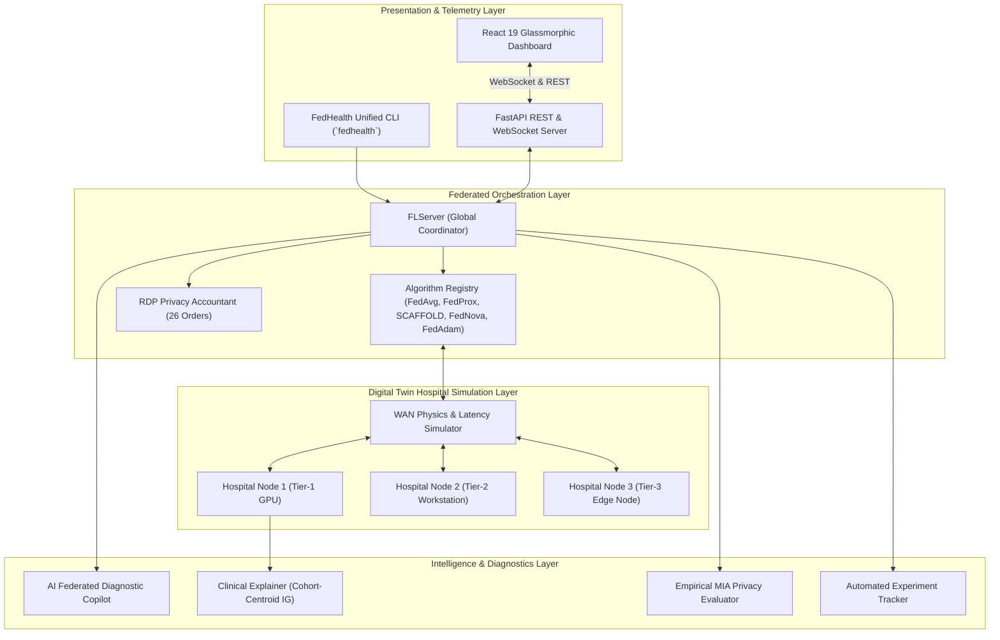
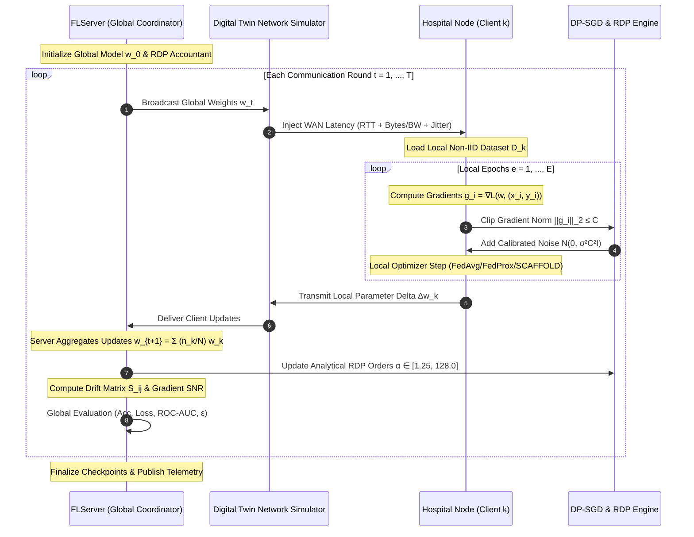
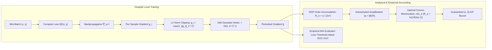
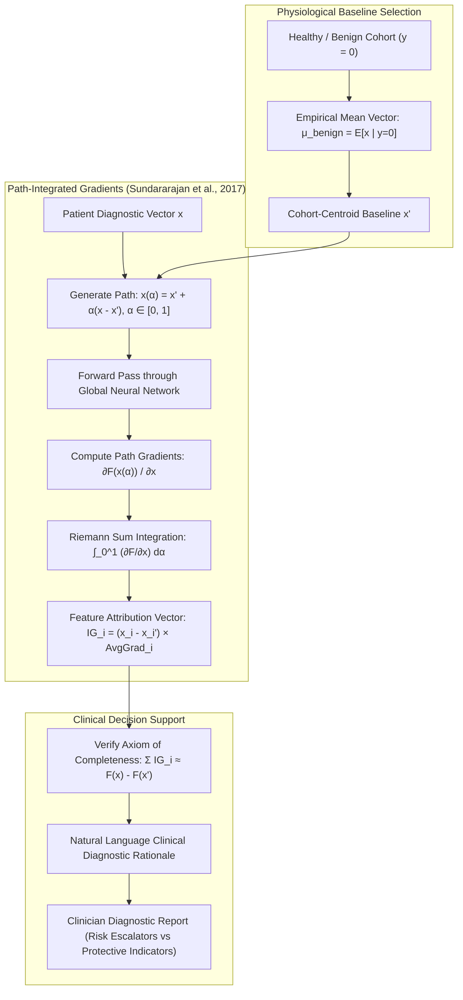

# FedHealth System Architecture & Engineering Diagrams

This document provides visual and technical diagrams of the **FedHealth v1.0.0** architecture, communication workflows, privacy pipelines, and Explainable AI subsystems.

---

## 1. High-Level Layered System Architecture

---

## 2. Federated Communication & Aggregation Sequence Diagram

---

## 3. Differential Privacy (DP-SGD & RDP) Pipeline

---

## 4. Clinically Grounded Explainable AI (XAI) Pipeline

